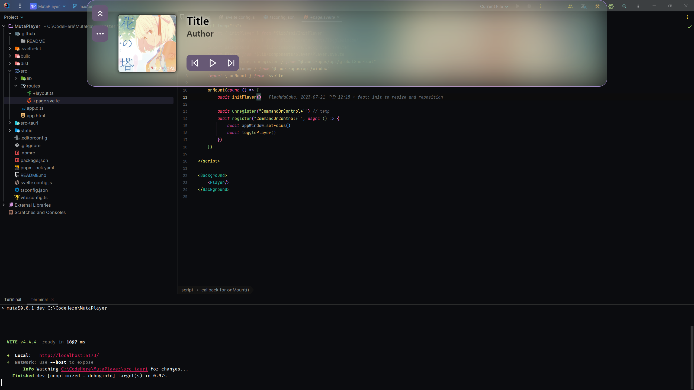

# Muta Music Player (WIP)

| Previews                                 |
|------------------------------------------|
| in the background                        |
|  |
| in the IDE                               |
|    |

## Shortcuts

- Open the player
    - `Ctrl` + ``` ` ``` (Backtick, Grave)

## Developing

```bash
pnpm install  # Installs dependencies
pnpm tauri dev  # Starts the development server
```

# License

[MIT](LICENSE)